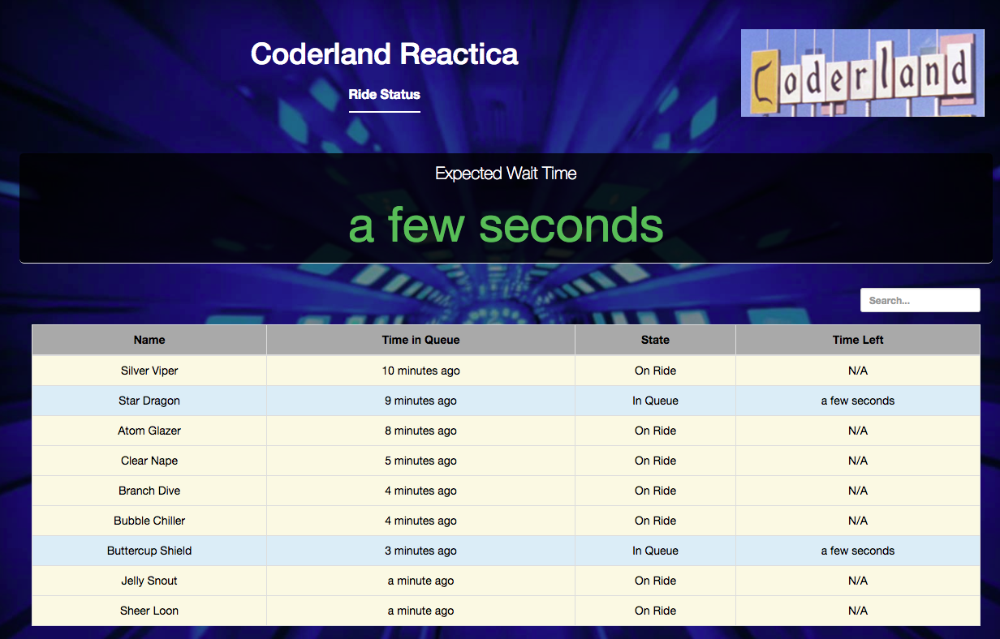

# `Reactica`

## Setup


### Install and setup required services

```bash
./deploy.sh
```

This script requires `minishift` and `curl` to be available in your `$PATH` as well as Internet access.

It:

* Starts minishift with the right configuration if it is not yet started
* Deploys the image streams and template
* Adjusts permissions
* Instantiates the Red Hat AMQ broker and Red Hat Data Grid 
* Waits for the data grid and AMQ broker to be in the `ready` state.

The script _should be idempotent_.

### Configure the application 

The file `application.yaml` in the `setup` directory defines parameters that control how often new users enter the queue, how long a ride lasts, and how many people can ride at the same time. The original file looks like this: 

```yaml
---
user-simulator:
  period-in-seconds: 5
  jitter-in-seconds: 2
  enabled: false

ride-simulator:
  duration-in-seconds: 30
  users-per-ride: 5
  jitter-in-seconds: 5
  enabled: true
```

The value `user-simulator\period-in-seconds` sets how many seconds go by before a new user gets in line. `ride-simulator\duration-in-seconds` is how long the ride takes, and `ride-simulator\users-per-ride` is how many people can ride at once. 

From the `setup` directory, run `./create-application-config.sh` to create a new Kubernetes `ConfigMap` with your values. If you want to change those values in the future, type `oc edit configmap reactica-config`. That puts you into the default editor for your system. Edit, save your changes, and everything is updated. It may take a few seconds before the changes take effect, but you should see the results in the behavior of the web UI. 

### Install the application

```bash
./deploy-application.sh
```

This script requires `mvn` and `minishift` to be available in your `$PATH` as well as Internet access.

It:

* Builds the application and its services
* Deploys the application
* Waits for all of the components to be in both the `Running` and `ready` states.

### Run the application

When the `deploy-application.sh` script is done, you should see something like this: 

```
✔️  Pod event-generator is Running
✔️  Pod event-generator is ready
✔️  Pod event-store is Running
✔️  Pod event-store is ready
✔️  Pod current-line-updater is Running
✔️  Pod current-line-updater is ready
✔️  Pod queue-length-calculator is Running
✔️  Pod queue-length-calculator is ready
✔️  Pod billboard is Running
✔️  Pod billboard is ready
```

Now it's time to actually work with the coaster. You'll need the URL of the web UI; that means finding the Kubernetes route to the `event-generator` pod. `oc get routes` does the trick: 

```bash
$ oc get routes

NAME                      HOST/PORT                                                          PATH SERVICES         PORT                TERMINATION   WILDCARD
billboard                 billboard-reactive-demo.192.168.64.37.nip.io                       billboard             8080                None
console                   console-reactive-demo.192.168.64.37.nip.io                         eventstream-amq-jolokia <all>             None
current-line-updater      current-line-updater-reactive-demo.192.168.64.37.nip.io            current-line-updater  8080                None
event-generator           event-generator-reactive-demo.192.168.64.37.nip.io                 event-generator       8080                None
event-store               event-store-reactive-demo.192.168.64.37.nip.io                     event-store           8080                None
eventstore-dg             eventstore-dg-reactive-demo.192.168.64.37.nip.io                   eventstore-dg         <all>               None
queue-length-calculator   queue-length-calculator-reactive-demo.192.168.64.37.nip.io         queue-length-calculator   8080 None
```

(Apologies for the clumsiness of this listing.) If you look at the first line of the output, you'll see that the URL of the `billboard` component is `billboard-reactive-demo.192.168.64.37.nip.io`. Paste that into your browser and you should see the web UI: 


